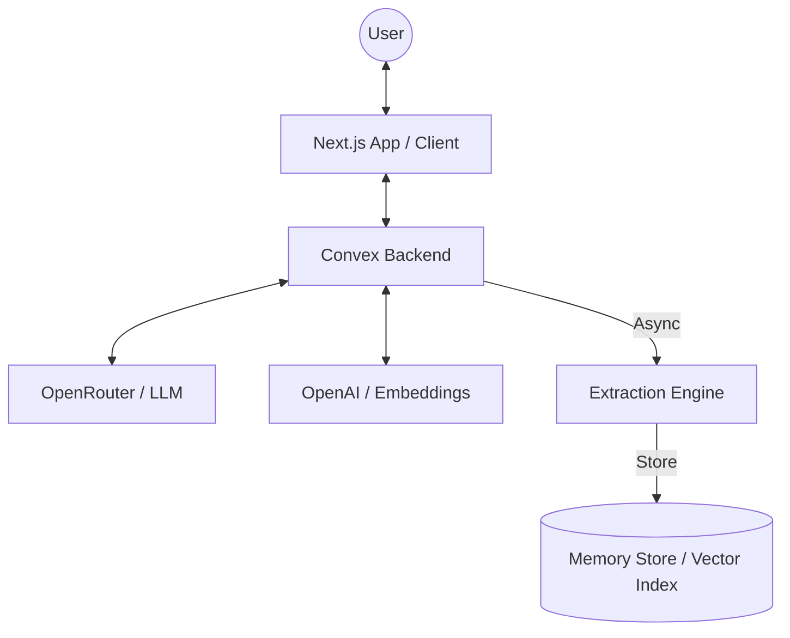

# 🧠 AgentMemory

AgentMemory is a production-ready AI Agent Memory System that provides LLMs with a persistent, human-like long-term memory. It enables AI agents to retain facts, preferences, and interaction history across distinct sessions, transforming stateless chats into continuous, personalized relationships.

## ✨ Core Features

- **Multi-Tier Memory**: Seamlessly manages Short-Term (context window), Episodic (conversations), and Semantic (long-term facts) memory.
- **Hybrid Retrieval**: Ranks context using vector similarity, recency decay, and domain-specific importance.
- **Async Extraction**: Background LLM jobs distill new knowledge from interactions without impacting real-time performance.
- **Memory Explorer**: A dedicated hub to browse and manage the agent's internal knowledge base.

## 💡 Why Convex?

We chose **Convex** as the backbone infrastructure for AgentMemory over traditional stacks (like PostgreSQL + Pinecone) for several key reasons:

1. **Integrated Vector Database**: Convex provides a native vector index that lives alongside your relational data. This eliminates the need for external vector stores, reducing architectural complexity and point-of-failure risks.
2. **Deterministic Reactivity**: The frontend automatically stays in sync with the backend via WebSocket subscriptions. When a background job finishes extracting a memory, the UI updates instantly without polling.
3. **Atomic Transactions**: All database operations (including vector writes) are fully ACID compliant. This ensures that memory extraction and session updates happen safely and consistently.
4. **Serverless Actions**: Complex LLM orchestrations (OpenRouter + OpenAI) run in sandboxed Actions, keeping the database "pure" while allowing for high-performance, long-running AI workflows.
5. **Developer Velocity**: One unified codebase for schema, backend functions, and cron jobs drastically speeds up deployment and maintenance.

## 🛠 Tech Stack

- **Framework**: Next.js 14 (App Router)
- **Backend**: [Convex](https://www.convex.dev/) (Reactive DB + Vector Index)
- **LLM**: OpenRouter (GPT-4o)
- **Embeddings**: OpenAI (`text-embedding-3-small`)
- **UI**: Vanilla CSS (Premium Custom Design)

## 🚀 Getting Started

1. **Install**: `npm install`
2. **Env**: Set `NEXT_PUBLIC_CONVEX_URL`, `OPENROUTER_API_KEY`, and `OPENAI_API_KEY` in `.env.local`
3. **Run**: `npx convex dev` and `npm run dev`

## 📦 Deployment

### Backend (Convex)
`npx convex deploy` — then set keys in the dashboard.

### Frontend (Vercel)
Connect your repo, set `NEXT_PUBLIC_CONVEX_URL`, and deploy.

## 🏗 Architecture

The system uses a **Retrieval-Augmented Generation (RAG)** approach optimized for personal memory:

- **Extraction**: Post-chat background task distills facts.
- **Persistence**: Facts are embedded and indexed.
- **Retrieval**: Hybrid re-ranking based on similarity, recency, and importance.
- **Consolidation**: Nightly cleanup of duplicate/stale entries.

## 📄 License
MIT
